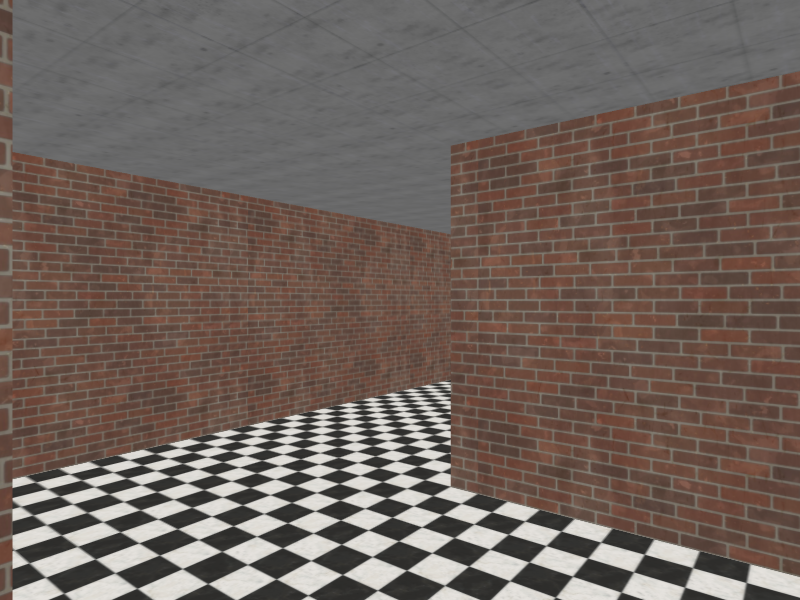

# Penjelasan Proyek: Gymnasium GridWorld dengan Deep Q-Learning

Di dalam proyek ini, saya telah melengkapi kodingan untuk membuat dan menjalankan environment `GridWorld-v0` berbasis framework Gymnasium, yang merupakan kelanjutan dari tutorial pembuatan environment kustom. Selain itu, saya telah menambahkan implementasi Reinforcement Learning (khususnya *Deep Q-Learning*) menggunakan library PyTorch agar agen (agent) dapat belajar mencari jalan terbaik menuju target secara cerdas.

## Mengenai Reinforcement Learning dan Deep Q-Learning

**Reinforcement Learning (RL)** adalah salah satu cabang dari *Machine Learning* di mana sebuah agen belajar untuk mengambil keputusan (action) berdasarkan *state* atau observasi dari sebuah environment untuk memaksimalkan *reward* kumulatif. Agen belajar melalui interaksi terus-menerus dengan *environment* berdasarkan sistem *trial and error*.

Pada kasus ini, saya mengimplementasikan algoritma **Deep Q-Learning (DQN)** sesuai dengan [dokumentasi resmi tutorial PyTorch](https://docs.pytorch.org/tutorials/intermediate/reinforcement_q_learning.html). Secara tradisional, algoritma Q-Learning menggunakan tabel (Q-table) untuk menyimpan nilai prediksi *reward* masa depan dari setiap pasangan state-action. Namun, untuk kasus dengan *state space* yang sangat besar, tabel tersebut menjadi tidak efisien. 

Oleh karena itu, **DQN** menggabungkan *Q-Learning* dengan *Deep Neural Networks*. Neural network digunakan untuk memprediksi atau mendekati nilai Q (*Q-values*) dari sebuah observasi. 

Berikut adalah beberapa komponen kunci dari implementasi DQN di dalam *script* `train_dqn.py`:
1. **Network Architecture (`DQN` class)**: Saya membuat *Multi-Layer Perceptron* (MLP) dengan *Linear layers* (menggunakan fungsi aktivasi ReLU). Network ini menerima array representasi agen dan target (berukuran 4 nilai koordinat hasil *Flatten*) dan mengeluarkan 4 nilai Q yang berkorespondensi pada 4 aksi (Kanan, Atas, Kiri, Bawah).
2. **Replay Memory**: Agen tidak langsung belajar dari urutan pengalaman terakhirnya (yang saling berkorelasi secara temporal), melainkan menyimpan transisi `(state, action, next_state, reward, terminated)` ke dalam *memory buffer*. Proses belajar kemudian secara acak mengambil sampel (*mini-batch*) dari *buffer* ini. Hal ini penting untuk menstabilkan training.
3. **Target Network**: Saya menggunakan dua jaringan terpisah: `policy_net` dan `target_net`. Jaringan *policy* di-*update* parameter bobotnya di setiap langkah, sedangkan jaringan *target* yang digunakan untuk menghitung nilai ekspektasi (Bellman Equation), di-*update* secara lambat *(soft update)* dari jaringan *policy*. Ini mencegah masalah *moving target* dan mempercepat konvergensi.
4. **Epsilon-Greedy Exploration**: Agen di awal akan mengambil aksi secara acak (eksplorasi) ketika epsilon bernilai mendekati 1.0. Seiring berjalannya jumlah iterasi training, nilai epsilon ini secara perlahan diturunkan *(decay)* sehingga agen mulai lebih condong memanfaatkan pengetahuan (eksploitasi) yang didapatkan dari neural network-nya yang semakin membaik.

## Cara Menjalankan Proyek

Untuk mempermudah validasi dan memenuhi kriteria, saya membagi alur jalannya proyek menjadi dua tahap utama: melatih agen dan menjalankan demonstrasinya.

### Langkah 1: Instalasi Kebutuhan (Jika Belum)
Pastikan Anda sudah menginstal paket lokal ini beserta PyTorch dan Matplotlib. Jalankan perintah ini di terminal:
```bash
pip install torch matplotlib
pip install -e .
```

### Langkah 2: Melatih Model (Training)
Jalankan file `train_dqn.py` untuk melatih agen:
```bash
python train_dqn.py
```
*Script* ini akan melatih agen menggunakan algoritma DQN sebanyak 400 episode (atau 600 jika menggunakan GPU). Setelah proses selesai yang hanya memakan waktu beberapa detik, bobot model *neural network* terbaik akan otomatis tersimpan dalam file bernama `dqn_model.pth`.

### Langkah 3: Mendapatkan Screenshot dan Demonstrasi Video
Untuk memenuhi persyaratan **Acceptance Criteria**, jalankan *script* `record_demo.py` yang akan melakukan dua tindakan ini secara otomatis:

1. **Menyimpan Screenshot**: *Script* akan merender posisi awal environment menggunakan mode `rgb_array`, mem-plot *image*-nya dengan Matplotlib, dan menyimpannya di direktori proyek Anda dengan nama `video/screenshot.png`.
2. **Demonstrasi 25 Detik**: *Script* kemudian akan membuka jendela simulasi *PyGame* (mode `human`) dan menggunakan otak agen (dari model `dqn_model.pth`) untuk menyelesaikan labirin *GridWorld* secara berulang-ulang tanpa henti selama lebih dari 20 detik (sekitar 25 detik) secara otomatis.
   
> [!IMPORTANT]  
> **CARA MENDAPATKAN VIDEO DEMONSTRASI:**
> Sambil jendela PyGame *GridWorld* berjalan otomatis memamerkan kecerdasan agen selama 25 detik tersebut, **silakan Anda merekam layar (Screen Record)** menggunakan fitur bawaan Windows (Xbox Game Bar / Snipping Tool) atau aplikasi seperti OBS. Anda dapat langsung menggunakan hasil rekaman tersebut untuk dikumpulkan.

Jalankan skripnya menggunakan perintah ini:
```bash
python record_demo.py
```

## Hasil Eksekusi (Acceptance Criteria)

### Screenshot Environment
*(Silakan ganti URL gambar di bawah ini dengan screenshot yang tersimpan di `video/screenshot.png` atau unggah langsung)*


### Video Demonstrasi
*(Berikut adalah video demonstrasi dari agen yang telah dilatih berjalan secara otomatis)*
[Tonton Video Demonstrasi di sini](video/2026-06-15%2021-14-29.mp4)

## Penambahan: Implementasi 3D MiniWorld (Maze)

Selain lingkungan GridWorld 2D di atas, saya juga telah menambahkan implementasi lingkungan **3D** menggunakan **Farama MiniWorld** ([dokumentasi resmi](https://miniworld.farama.org/environments/maze/)). Lingkungan yang saya pilih adalah **Maze** (`MiniWorld-Maze-v0`), di mana agen ditempatkan di dalam sebuah labirin 3D dan harus menavigasi untuk menemukan **kotak merah** (target) yang tersembunyi di suatu titik di labirin.

### Apa Bedanya dengan GridWorld 2D?

Perbedaan antara GridWorld 2D dan MiniWorld 3D sangat signifikan, dan inilah yang membuat implementasi ini menarik:

| Aspek | GridWorld 2D | MiniWorld 3D (Maze) |
|---|---|---|
| **Perspektif** | Tampak atas (*top-down*) | Sudut pandang orang pertama (*first-person*) |
| **Observasi (Input)** | 4 angka koordinat (posisi agen + target) | Gambar RGB 60×80 pixel (14.400 nilai!) |
| **Action Space** | 4 aksi (atas, bawah, kiri, kanan) | 3 aksi (belok kiri, belok kanan, maju) |
| **Arsitektur Neural Network** | MLP (Multi-Layer Perceptron) sederhana | **CNN** (Convolutional Neural Network) |
| **Kompleksitas** | Rendah — grid kecil | Tinggi — labirin besar dengan lorong-lorong |

Karena agen di MiniWorld **hanya bisa melihat apa yang ada di depannya** (seperti manusia sungguhan berjalan di dalam labirin), ia tidak tahu peta keseluruhan. Ini jauh lebih menantang dibandingkan GridWorld di mana agen bisa "melihat" semua dari atas.

### Mengapa Perlu CNN (Convolutional Neural Network)?

Di GridWorld, observasi hanyalah 4 angka (koordinat agen dan target). Cukup menggunakan MLP (*Multi-Layer Perceptron*) biasa untuk memproses angka-angka tersebut.

Namun di MiniWorld, observasi adalah **gambar RGB** berukuran 60×80×3 pixel. Jika saya coba meratakan (*flatten*) semua piksel ini dan memasukkannya ke MLP biasa, hasilnya akan sangat buruk karena:
- MLP tidak memahami **hubungan spasial** antar piksel (piksel yang berdekatan saling terkait secara visual)
- Jumlah parameter akan sangat besar dan tidak efisien

Oleh karena itu, saya menggunakan **CNN** yang dirancang khusus untuk data visual. CNN bekerja dengan *filter* (kernel) yang bergeser (*sliding*) di atas gambar untuk mendeteksi pola visual seperti:
- **Garis-garis** tepi dinding
- **Warna** kotak merah (target)
- **Koridor** yang bisa dilewati

Arsitektur `CnnDQN` yang saya implementasikan di file `train_maze_dqn.py` terinspirasi dari paper klasik DeepMind "*Playing Atari with Deep Reinforcement Learning*" (2013):

```
Gambar RGB (3, 60, 80)
  → Conv2d 32 filter (8×8, stride 4) + ReLU   → Deteksi pola dasar
  → Conv2d 64 filter (4×4, stride 2) + ReLU   → Deteksi pola kompleks
  → Conv2d 64 filter (3×3, stride 1) + ReLU   → Fitur tingkat tinggi
  → Flatten menjadi vektor 1D (1536 nilai)
  → Linear 512 neuron + ReLU                  → Pengambilan keputusan
  → Linear 3 neuron (output)                  → Q-value untuk 3 aksi
```

### Deskripsi Program-Program MiniWorld

#### 1. `train_maze_dqn.py` — Melatih Agen CNN-DQN

Script ini melatih agen menggunakan algoritma **Deep Q-Learning dengan CNN** untuk menyelesaikan labirin 3D. Komponen-komponen utamanya:

1. **Preprocessing**: Gambar mentah (uint8, 0-255) dinormalisasi ke float (0.0-1.0) dan diubah formatnya dari `(H, W, C)` ke `(C, H, W)` sesuai konvensi PyTorch.
2. **CnnDQN**: Arsitektur CNN yang mengekstrak fitur visual dari gambar, lalu menghasilkan Q-value untuk setiap aksi.
3. **Replay Memory**: Menyimpan transisi pengalaman agen untuk sampel acak saat training (mencegah korelasi temporal).
4. **Target Network + Soft Update**: Menstabilkan training, sama seperti di GridWorld tetapi dengan arsitektur CNN.
5. **Epsilon-Greedy**: Awalnya 100% eksplorasi acak, perlahan bergeser ke eksploitasi seiring agen belajar.

Setelah training selesai, model terbaik akan tersimpan sebagai `maze_dqn_model.pth`.

#### 2. `run_maze.py` — Demo dan Screenshot

Program ini menjalankan agen di dalam labirin dan menyimpan screenshot. Jika file model `maze_dqn_model.pth` ditemukan, agen akan menggunakan "otaknya" (model CNN-DQN terlatih) untuk bernavigasi. Jika model belum ada, agen akan bergerak secara acak.

### Screenshot Lingkungan 3D MiniWorld (Maze)

Berikut adalah hasil tangkapan layar (*screenshot*) dari sudut pandang agen di dalam labirin 3D:



### Cara Menjalankan

#### Langkah 1: Instalasi Kebutuhan
Pastikan Anda sudah menginstal library berikut:
```bash
pip install miniworld gymnasium torch numpy pillow
```

#### Langkah 2: Melatih Model CNN-DQN (Opsional)
Jika Anda ingin melatih agen agar bisa bernavigasi secara cerdas di labirin:
```bash
python train_maze_dqn.py
```
> **Catatan**: Training ini memakan waktu lebih lama dibandingkan GridWorld karena data yang diproses jauh lebih besar (gambar vs angka). Di CPU, perkiraan waktu sekitar beberapa menit.

#### Langkah 3: Menjalankan Demo dan Mendapatkan Screenshot
```bash
python run_maze.py
```
Script ini akan otomatis mendeteksi apakah model terlatih tersedia dan memilih mode yang sesuai (agen cerdas atau acak), lalu menyimpan screenshot sebagai `maze_screenshot.png`.

#### Langkah 4: Melatih Model Tingkat Lanjut (PPO)
Jika DQN kesulitan menyelesaikan labirin (mendapat skor negatif secara konstan), Anda bisa melatih model menggunakan algoritma **Proximal Policy Optimization (PPO)** yang jauh lebih canggih dan stabil:
```bash
python train_maze_ppo.py
```
Model PPO ini ditulis murni menggunakan PyTorch dan akan menyimpan bobotnya di `maze_ppo_model.pth`.
