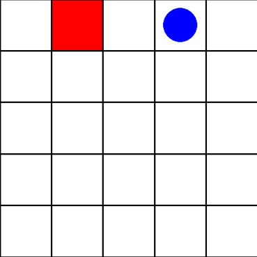

# Penjelasan Proyek: Gymnasium GridWorld dengan Deep Q-Learning

Di dalam proyek ini, saya telah melengkapi kodingan untuk membuat dan menjalankan environment `GridWorld-v0` berbasis framework Gymnasium, yang merupakan kelanjutan dari tutorial pembuatan environment kustom. Selain itu, saya telah menambahkan implementasi Reinforcement Learning (khususnya *Deep Q-Learning*) menggunakan library PyTorch agar agen (agent) dapat belajar mencari jalan terbaik menuju target secara cerdas.

## Mengenai Reinforcement Learning dan Deep Q-Learning

**Reinforcement Learning (RL)** adalah salah satu cabang dari *Machine Learning* di mana sebuah agen belajar untuk mengambil keputusan (action) berdasarkan *state* atau observasi dari sebuah environment untuk memaksimalkan *reward* kumulatif. Agen belajar melalui interaksi terus-menerus dengan *environment* berdasarkan sistem *trial and error*.

Pada kasus ini, saya mengimplementasikan algoritma **Deep Q-Learning (DQN)** sesuai dengan [dokumentasi resmi tutorial PyTorch](https://docs.pytorch.org/tutorials/intermediate/reinforcement_q_learning.html). Secara tradisional, algoritma Q-Learning menggunakan tabel (Q-table) untuk menyimpan nilai prediksi *reward* masa depan dari setiap pasangan state-action. Namun, untuk kasus dengan *state space* yang sangat besar, tabel tersebut menjadi tidak efisien. 

Oleh karena itu, **DQN** menggabungkan *Q-Learning* dengan *Deep Neural Networks*. Neural network digunakan untuk memprediksi atau mendekati nilai Q (*Q-values*) dari sebuah observasi. 

Berikut adalah beberapa komponen kunci dari implementasi DQN di dalam *script* `train_dqn.py`:
1. **Network Architecture (`DQN` class)**: Saya membuat *Multi-Layer Perceptron* (MLP) dengan *Linear layers* (menggunakan fungsi aktivasi ReLU). Network ini menerima array representasi agen dan target (berukuran 4 nilai koordinat hasil *Flatten*) dan mengeluarkan 4 nilai Q yang berkorespondensi pada 4 aksi (Kanan, Atas, Kiri, Bawah).
2. **Replay Memory**: Agen tidak langsung belajar dari urutan pengalaman terakhirnya (yang saling berkorelasi secara temporal), melainkan menyimpan transisi `(state, action, next_state, reward, terminated)` ke dalam *memory buffer*. Proses belajar kemudian secara acak mengambil sampel (*mini-batch*) dari *buffer* ini. Hal ini penting untuk menstabilkan training.
3. **Target Network**: Saya menggunakan dua jaringan terpisah: `policy_net` dan `target_net`. Jaringan *policy* di-*update* parameter bobotnya di setiap langkah, sedangkan jaringan *target* yang digunakan untuk menghitung nilai ekspektasi (Bellman Equation), di-*update* secara lambat *(soft update)* dari jaringan *policy*. Ini mencegah masalah *moving target* dan mempercepat konvergensi.
4. **Epsilon-Greedy Exploration**: Agen di awal akan mengambil aksi secara acak (eksplorasi) ketika epsilon bernilai mendekati 1.0. Seiring berjalannya jumlah iterasi training, nilai epsilon ini secara perlahan diturunkan *(decay)* sehingga agen mulai lebih condong memanfaatkan pengetahuan (eksploitasi) yang didapatkan dari neural network-nya yang semakin membaik.

## Cara Menjalankan Proyek

Untuk mempermudah validasi dan memenuhi kriteria, saya membagi alur jalannya proyek menjadi dua tahap utama: melatih agen dan menjalankan demonstrasinya.

### Langkah 1: Instalasi Kebutuhan (Jika Belum)
Pastikan Anda sudah menginstal paket lokal ini beserta PyTorch dan Matplotlib. Jalankan perintah ini di terminal:
```bash
pip install torch matplotlib
pip install -e .
```

### Langkah 2: Melatih Model (Training)
Jalankan file `train_dqn.py` untuk melatih agen:
```bash
python train_dqn.py
```
*Script* ini akan melatih agen menggunakan algoritma DQN sebanyak 400 episode (atau 600 jika menggunakan GPU). Setelah proses selesai yang hanya memakan waktu beberapa detik, bobot model *neural network* terbaik akan otomatis tersimpan dalam file bernama `dqn_model.pth`.

### Langkah 3: Mendapatkan Screenshot dan Demonstrasi Video
Untuk memenuhi persyaratan **Acceptance Criteria**, jalankan *script* `record_demo.py` yang akan melakukan dua tindakan ini secara otomatis:

1. **Menyimpan Screenshot**: *Script* akan merender posisi awal environment menggunakan mode `rgb_array`, mem-plot *image*-nya dengan Matplotlib, dan menyimpannya di direktori proyek Anda dengan nama `video/screenshot.png`.
2. **Demonstrasi 25 Detik**: *Script* kemudian akan membuka jendela simulasi *PyGame* (mode `human`) dan menggunakan otak agen (dari model `dqn_model.pth`) untuk menyelesaikan labirin *GridWorld* secara berulang-ulang tanpa henti selama lebih dari 20 detik (sekitar 25 detik) secara otomatis.
   
> [!IMPORTANT]  
> **CARA MENDAPATKAN VIDEO DEMONSTRASI:**
> Sambil jendela PyGame *GridWorld* berjalan otomatis memamerkan kecerdasan agen selama 25 detik tersebut, **silakan Anda merekam layar (Screen Record)** menggunakan fitur bawaan Windows (Xbox Game Bar / Snipping Tool) atau aplikasi seperti OBS. Anda dapat langsung menggunakan hasil rekaman tersebut untuk dikumpulkan.

Jalankan skripnya menggunakan perintah ini:
```bash
python record_demo.py
```

## Hasil Eksekusi (Acceptance Criteria)

### Screenshot Environment
*(Silakan ganti URL gambar di bawah ini dengan screenshot yang tersimpan di `video/screenshot.png` atau unggah langsung)*


### Video Demonstrasi
*(Berikut adalah video demonstrasi dari agen yang telah dilatih berjalan secara otomatis)*
[Tonton Video Demonstrasi di sini](video/2026-06-15%2021-14-29.mp4)

